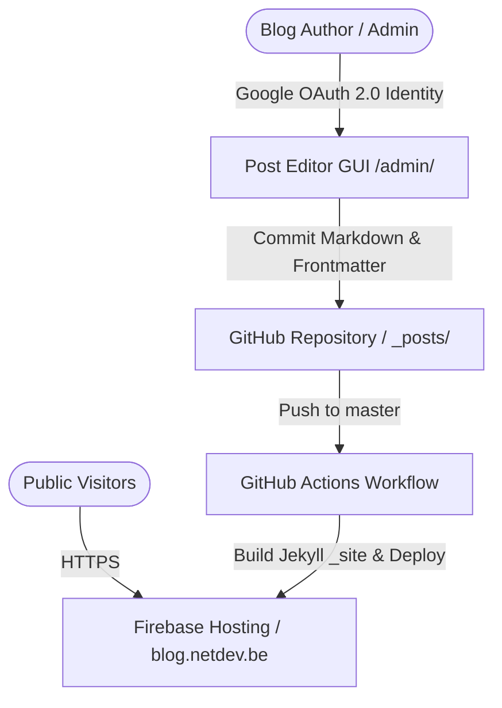

# netdev Blog (`blog.netdev.be`)

Personal engineering blog and admin CMS built with Jekyll, hosted on Firebase Hosting (`netdev-firebase`), and backed by Google Authentication.

---

## Architecture Overview



---

## Key Features & Structure

* **Static Site Generator**: Built on **Jekyll 4.x** with custom responsiveness and performance optimizations.
* **Hosting Platform**: Automated build & deploy to **Firebase Hosting** (Project: `netdev-firebase`).
* **Interactive Post Editor (`/admin`)**:
  * Rich-text Markdown editing with EasyMDE and live preview.
  * Google Identity Services (GIS) / Firebase Auth login restricted to authorized admins.
  * Direct GitHub REST API integration to fetch, edit, create, and commit markdown files directly into `_posts/`.
* **Security & Performance**:
  * Content Security Policy (CSP) enforcement and font preconnecting.
  * Subresource Integrity (SRI) for external CDN assets.
  * Staticman form origin validation.

---

## Directory Structure

```text
├── _posts/                 # Blog post Markdown files (YYYY-MM-DD-title.md)
├── admin/                  # Web-based Post Editor CMS GUI
│   └── index.html          # Main admin editor layout
├── assets/
│   ├── js/admin.js         # GitHub API & Auth logic for /admin
│   ├── js/firebase-config.js # Firebase SDK & Google Auth helper
│   └── css/admin.css       # Post editor styling
├── _includes/              # Jekyll partials (head, header, footer)
├── _layouts/               # Page layouts (default, post, page)
├── .github/workflows/      # GitHub Actions CI/CD deployment pipeline
├── firebase.json           # Firebase Hosting routing & caching rules
└── _config.yml             # Main site configuration
```

---

## Local Development

### 1. Requirements
* Ruby (v3.0+)
* Bundler (`gem install bundler`)

### 2. Run Locally
```bash
# Install dependencies
bundle install

# Serve local Jekyll preview (http://localhost:4000)
bundle exec jekyll serve
```

---

## Admin Post Editor (`/admin`)

To edit or create posts via the web interface:
1. Navigate to `/admin` on your deployed site or local server.
2. Sign in with your authorized Google Admin account.
3. Enter your GitHub Personal Access Token (PAT with `repo` scope).
4. Create or edit posts — commits are pushed directly to `_posts/` in the GitHub repository, triggering an automatic site rebuild and deployment.

---

## Deployment Pipeline

Deployments to Firebase Hosting are fully automated via GitHub Actions:
* **Workflow**: `.github/workflows/firebase-hosting.yml`
* **Trigger**: Every `push` to the `master` branch.
* **Deployment target**: Firebase Hosting project `netdev-firebase` (Site: `netdev-blog`).
