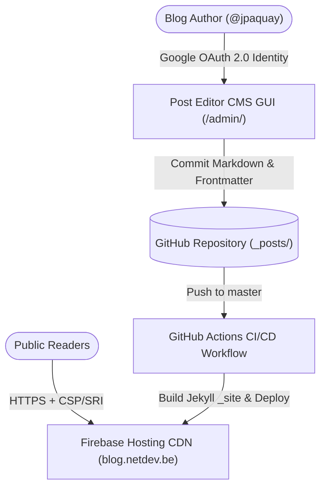

# `/net/dev` Engineering Blog & Web CMS (`blog.netdev.be`)

[](https://creativecommons.org/licenses/by-sa/4.0/)
[-blue)](https://github.com/jpaquay)
[](https://jekyllrb.com/)
[](https://firebase.google.com/products/hosting)
[](https://blog.netdev.be)

Personal cloud engineering blog, essays, and browser-based GitHub CMS authored and maintained by **Jerome CG Paquay (`@jpaquay`)**. Built with **Jekyll 5.x**, hosted on **Firebase Hosting (`netdev-firebase`)**, and backed by **Google Identity Services (OAuth 2.0)** + direct GitHub API publishing.

---

## 🏗️ System Architecture


```mermaid
flowchart TD
    User(["Public Readers"]) -->|HTTPS + CSP/SRI| FirebaseHosting["Firebase Hosting CDN (blog.netdev.be)"]
    Admin(["Blog Author (@jpaquay)"]) -->|Google OAuth 2.0 Identity| AdminGUI["Post Editor CMS GUI (/admin/)"]
    AdminGUI -->|Commit Markdown & Frontmatter| GitHubRepo[("GitHub Repository (_posts/)")]
    GitHubRepo -->|Push to master| GHActions["GitHub Actions CI/CD Workflow"]
    GHActions -->|Build Jekyll _site & Deploy| FirebaseHosting
```

For a full engineering, security, and hygiene audit, see [docs/ARCHITECTURE_REVIEW.md](./docs/ARCHITECTURE_REVIEW.md) and [SECURITY.md](./SECURITY.md).

---

## ✨ Key Features & Structure

* **Static Site Generator**: Built on **Jekyll 5.x** with responsive layouts, RSS/Atom feeds (`public/rss.xml`, `public/blog/rss.xml`, `public/feed.xml`), and WebP media optimization.
* **Hosting Platform**: Automated build & global CDN delivery on **Firebase Hosting** (Project: `netdev-firebase`).
* **Interactive Post Editor (`/admin`)**:
  * Rich-text Markdown editing with EasyMDE and live split-pane preview.
  * Google Identity Services (GIS) / Firebase Auth login restricted to authorized admins.
  * Direct GitHub REST API integration to fetch, edit, create, and commit Markdown files directly into `_posts/`.
* **Security & Performance**:
  * Content Security Policy (CSP) enforcement and font preconnecting.
  * Subresource Integrity (SRI) for external CDN assets verified by automated Jest tests (`__tests__/`).
  * Staticman form origin validation.

---

## 📂 Directory Structure

```text
├── _posts/                 # Blog post Markdown files (YYYY-MM-DD-title.md)
├── admin/                  # Web-based Post Editor CMS GUI
│   └── index.html          # Main admin editor layout
├── assets/
│   ├── js/admin.js         # GitHub API & Auth logic for /admin
│   ├── js/firebase-config.js # Firebase SDK & Google Auth helper
│   └── css/admin.css       # Post editor styling
├── docs/
│   └── ARCHITECTURE_REVIEW.md # Architecture, security & hygiene audit
├── _includes/              # Jekyll partials (head, header, footer)
├── _layouts/               # Page layouts (default, post, page)
├── .github/workflows/      # GitHub Actions CI/CD deployment pipeline
├── firebase.json           # Firebase Hosting routing & caching rules
└── _config.yml             # Main site configuration
```

---

## 🚀 Local Development

### 1. Requirements
* Ruby (`v3.0+`)
* Bundler (`gem install bundler`)
* Node.js (`v20+`) for running Jest security & frontend tests

### 2. Run Locally
```bash
# Install Ruby dependencies
bundle install

# Serve local Jekyll preview (http://localhost:4000)
bundle exec jekyll serve --future

# Run Jest unit tests
npm test
```

---

## ✍️ Admin Post Editor (`/admin`)

To edit or create posts via the web interface:
1. Navigate to `/admin` on your deployed site or local server.
2. Sign in with your authorized Google Admin account.
3. Enter your GitHub Personal Access Token (PAT with `repo` scope).
4. Create or edit posts — commits are pushed directly to `_posts/` in the GitHub repository, triggering an automatic site rebuild and deployment.

---

## 🤝 Contributing

Contributions, bug reports, and improvements are welcome! See [CONTRIBUTING.md](./CONTRIBUTING.md) for guidelines.

---

## 👏 Credits & Author

Authored, architected, and maintained by **Jerome CG Paquay (`@jpaquay`)** — [https://github.com/jpaquay](https://github.com/jpaquay).
Underlying Jekyll theme template originally derived from *Beautiful Jekyll* by Dean Attali (MIT).

---

## 📜 License

All original articles, essays, diagrams, and custom CMS code are licensed under the **Creative Commons Attribution-ShareAlike 4.0 International License (`CC BY-SA 4.0`)** — Copyright © 2026 **Jerome CG Paquay (`@jpaquay`)**. See [LICENSE](./LICENSE) for full details.
