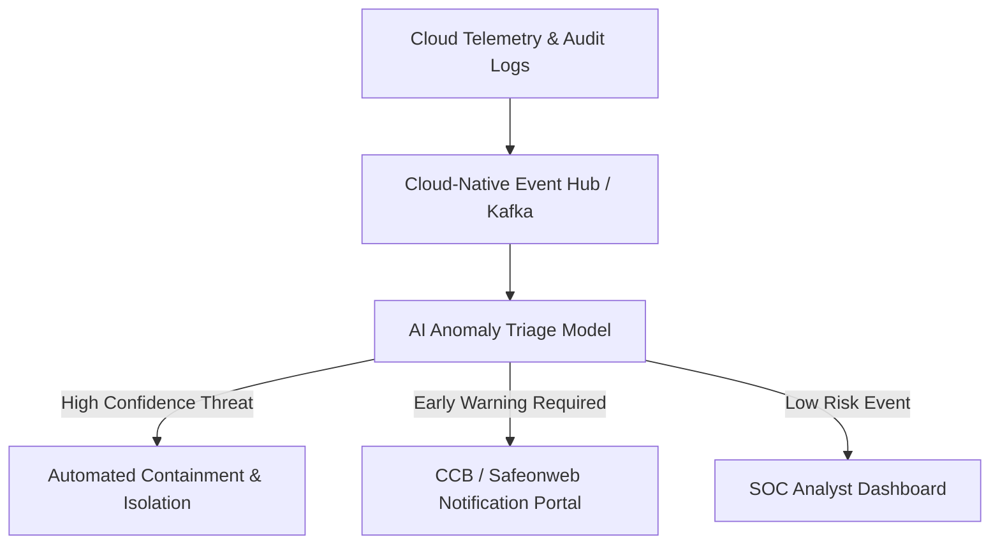

As the European Union finalised the **NIS2 Directive** (Network and Information Security Directive), organisations across Belgium—from Antwerp’s bustling port logistics to energy grids and healthcare networks—faced a pivotal shift in cybersecurity obligations.

{: .box-note}
**Key Takeaway:** NIS2 drastically expands the scope of covered entities and enforces strict incident notification timelines (24-hour early warning) along with direct executive management liability.

### The Belgian Context: CCB Enforcement & Critical Sectors

In Belgium, the **Centre for Cybersecurity Belgium (CCB)** spearheads the national transposition of NIS2. Essential and important entities are no longer just traditional telecommunication giants; supply chain partners, cloud service providers, and managed security service providers (MSSPs) are now directly accountable.

### Cloud Architecture & AI Threat Triage

To meet the mandatory 24-hour reporting window, security operations centers (SOCs) across Europe are turning to automated, cloud-native SIEM and AI-driven incident classification.

Here is a conceptual architecture for an NIS2-compliant AI triage pipeline:



### Incident Response Automation Snippet

Below is an example of an automated Cloud Function trigger that sanitises and formats a 24-hour NIS2 early warning alert:

```python
import os
import json
import requests

def notify_ccb_incident(event, context):
    """NIS2 Early Warning Trigger for Critical Cloud Incidents."""
    incident_data = json.loads(event.get('data', '{}'))
    
    severity = incident_data.get('severity', 'LOW')
    if severity in ['HIGH', 'CRITICAL']:
        payload = {
            "entity_id": os.getenv("BELGIUM_ENTITY_ID"),
            "timestamp": incident_data.get("timestamp"),
            "threat_vector": incident_data.get("type"),
            "early_warning_status": "INVESTIGATING_POSSIBLE_IMPACT",
            "initial_assessment": incident_data.get("summary")
        }
        # Send securely to NIS2 compliant incident reporting endpoint
        headers = {"Authorization": f"Bearer {os.getenv('NIS2_API_KEY')}"}
        response = requests.post(os.getenv("CCB_ALERT_ENDPOINT"), json=payload, headers=headers)
        return f"NIS2 Alert Dispatched: {response.status_code}"
    return "Event below critical threshold."
```

### Media & Visual Concept

- **Main Cover:** A futuristic, digital representation of Brussels' Atomium, glowing with interconnected cybersecurity mesh lines and data shields.
- **Diagram:** NIS2 Automated Detection & Reporting Pipeline (Mermaid diagram above).
