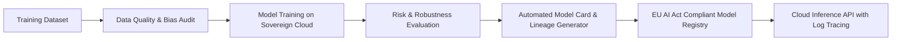

On **December 8, 2023**, after an intense 36-hour negotiation session in Brussels, European Union policymakers reached a landmark agreement on the **EU AI Act**—the world’s first comprehensive horizontal legal framework for Artificial Intelligence.

{: .box-note}
**What It Means for Developers:** AI systems are classified into risk tiers (Unacceptable, High, Limited, Minimal). High-risk systems (e.g. in hiring, credit scoring, critical infrastructure, healthcare) require rigorous data governance, technical documentation, automatic logging, and human oversight.

### Engineering Compliance into MLOps Pipelines

Compliance cannot be an afterthought handled by legal teams on PDF forms; it must be implemented directly in cloud MLOps infrastructure.



### Automated Model Lineage & Compliance Logger

Below is an example of registering a model's lineage and risk classification directly to MLflow or a custom compliance database:

```python
import datetime
import json

class EUAIActGovernanceLogger:
    def __init__(self, model_name: str, risk_category: str):
        self.model_name = model_name
        self.risk_category = risk_category
        self.metadata = {
            "model_name": model_name,
            "risk_category": risk_category,
            "training_timestamp": datetime.datetime.utcnow().isoformat(),
            "human_oversight_enabled": True,
            "training_data_sovereignty": "EU-WEST-3 (Paris/Frankfurt)",
            "bias_metrics": {}
        }

    def log_bias_check(self, parity_difference: float, threshold: float = 0.05):
        compliant = parity_difference <= threshold
        self.metadata["bias_metrics"] = {
            "demographic_parity_diff": parity_difference,
            "threshold": threshold,
            "compliant": compliant
        }
        return compliant

    def export_compliance_manifest(self, filepath: str):
        with open(filepath, 'w') as f:
            json.dump(self.metadata, f, indent=2)
        print(f"Compliance manifest exported to {filepath}")

# Usage
logger = EUAIActGovernanceLogger("CreditRiskScorer-v2", "HIGH_RISK")
logger.log_bias_check(0.03)
logger.export_compliance_manifest("model_compliance_manifest.json")
```

### Media & Visual Concept

- **Cover Image:** Nighttime skyline of Brussels with digital constellation motifs forming a European flag star around a neural network.
- **Diagram:** EU AI Act Risk-Tiered MLOps Workflow (Mermaid diagram above).
