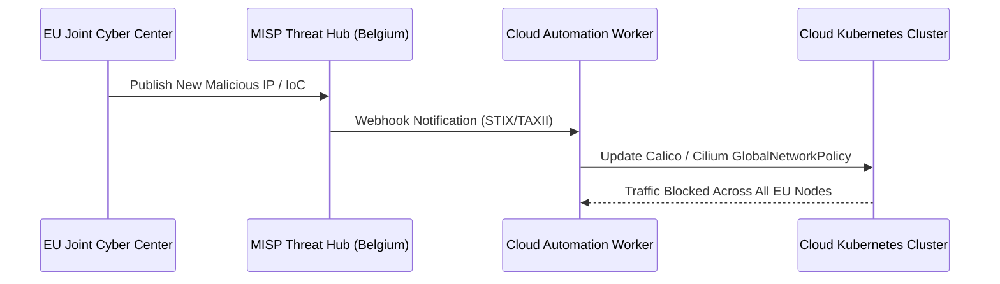

During the first half of 2024, Belgium held the **Presidency of the Council of the European Union**. Central to the Belgian presidency agenda was strengthening European cyber resilience ahead of national and European Parliament elections.

{: .box-note}
**Highlight:** Pan-European cyber crisis exercises, coordinated by ENISA and Belgium's Cyber Command, tested multi-cloud incident orchestration and cross-border threat intelligence sharing under extreme simulated attack conditions.

### Federated Threat Intelligence with MISP and Cloud Automation

A major takeaway from the 2024 exercises was the necessity of automated Indicator of Compromise (IoC) ingestion into cloud firewalls and Kubernetes Network Policies within seconds of discovery.



### Python MISP IoC Ingestion Script

```python
import requests

def sync_misp_iocs_to_cloud_firewall(misp_url: str, api_key: str):
    """Fetch high-confidence IoCs from Belgian MISP instance and sync to cloud security groups."""
    headers = {
        "Authorization": api_key,
        "Accept": "application/json",
        "Content-Type": "application/json"
    }
    query = {
        "returnFormat": "json",
        "type": "ip-dst",
        "to_ids": True,
        "tags": ["TLP:AMBER", "EU-PRESIDENCY-DRILL"]
    }
    
    response = requests.post(f"{misp_url}/attributes/restSearch", json=query, headers=headers)
    if response.status_code == 200:
        attributes = response.json().get("response", {}).get("Attribute", [])
        blocked_ips = [attr["value"] for attr in attributes]
        print(f"Syncing {len(blocked_ips)} malicious IPs to Cloud Ingress Rules...")
        return blocked_ips
    return []
```

### Media & Visual Concept

- **Cover Image:** High-tech command center in Brussels with European map displays showing real-time cyber telemetry nodes.
- **Diagram:** Cross-border MISP Automated Blocklist Pipeline (Mermaid diagram above).
