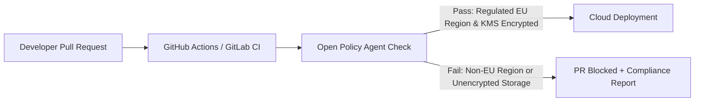

With **DORA (Digital Operational Resilience Act)** coming into force in January 2025 across European banking, insurance, and investment firms, alongside national NIS2 deadlines, compliance teams and engineering organizations faced a stark choice: **drown in manual spreadsheets or automate compliance as code.**

{: .box-important}
**DORA Pillars:** ICT Risk Management, Incident Reporting, Operational Resilience Testing, Third-Party Risk Management, and Information Sharing.

### Policy-as-Code with Open Policy Agent (OPA)

To guarantee that no cloud workload is deployed to unauthorized regions (outside EU data residency boundaries) or missing cryptographic encryption, European DevSecOps teams implement OPA policies into CI/CD pull request checks.



### OPA Rego Rule for DORA & NIS2 Sovereign Cloud Storage

```rego
package dora.compliance

default allow = false

# DORA Requirements: All persistent storage must reside in approved EU sovereign regions
approved_eu_regions = ["europe-west1", "europe-west3", "europe-west9"] # Belgium, Frankfurt, Paris

allow {
    input.resource_type == "cloud_storage_bucket"
    input.location == approved_eu_regions[_]
    input.encryption.kms_key_type == "CUSTOMER_MANAGED_EU_KEY"
}
```

### Automated Disaster Recovery & Chaos Testing

DORA explicitly mandates digital operational resilience testing, including threat-led penetration testing and business continuity failover verification. Automated chaos engineering tools (like Chaos Mesh or Gremlin) are now triggered periodically in cloud staging environments to validate mean time to recovery (MTTR).

### Media & Visual Concept

- **Cover Image:** Geometric golden shield merged with code blocks and gear mechanisms symbolizing continuous automated governance.
- **Diagram:** Policy-as-Code Gatekeeper Pipeline (Mermaid diagram above).
