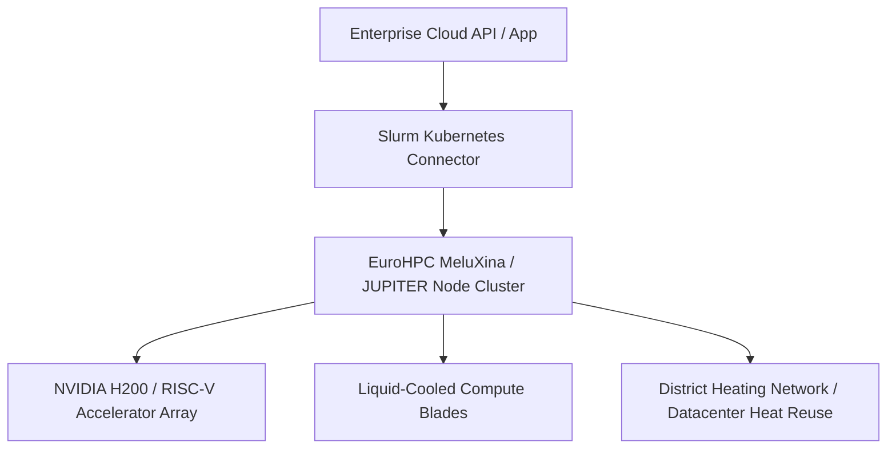

Spring 2025 marked the full operationalization of the **EuroHPC Joint Undertaking's exascale supercomputing network**—including JUPITER, Lumi, MeluXina (Luxembourg), and associated AI Factories across Belgium and the Benelux region.

{: .box-note}
**Sovereign Compute Power:** European researchers and enterprises now have access to GPU clusters operating on 100% renewable energy, training open European multilingual foundation models without depending exclusively on overseas hyperscaler clusters.

### The Hybrid Cloud + EuroHPC Orchestration Model

Modern AI workloads use cloud-native Kubernetes (via Slurm-Kubernetes operators) to seamlessly burst from enterprise cloud environments into EuroHPC exascale clusters for heavy pre-training runs.



### Slurm Job Submission Script for Distributed AI Fine-Tuning

```bash
#!/bin/bash
#SBATCH --job-name=euro_sovereign_llm
#SBATCH --nodes=8
#SBATCH --ntasks-per-node=4
#SBATCH --gres=gpu:4
#SBATCH --time=12:00:00
#SBATCH --partition=gpu-exascale

echo "Starting distributed training on EuroHPC node cluster..."
module load PyTorch/2.4.0-CUDA-12.2

srun python3 -m torch.distributed.run \
    --nnodes=8 \
    --nproc_per_node=4 \
    train_sovereign_model.py \
    --dataset_path=/p/scratch/euro_llm/dataset_multilingual_eu \
    --output_dir=/p/scratch/euro_llm/checkpoints
```

### Media & Visual Concept

- **Cover Image:** Futuristic, glowing liquid-cooled supercomputer blade racks inside an eco-friendly architectural datacenter by a canal.
- **Diagram:** Hybrid Cloud to EuroHPC Bursting Architecture (Mermaid diagram above).
