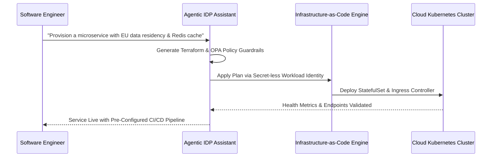

By late 2025, Internal Developer Platforms (IDPs) evolved beyond static self-service web portals into **Agentic Platform Mesh Orchestrators**. Rather than forcing developers to manually construct YAML manifests or navigate complex cloud portals, autonomous AI agents now act as interactive copilots for platform engineering teams across Europe.

{: .box-note}
**Key Evolution:** Developers describe desired service capabilities in high-level domain specs, while agentic orchestrators automatically generate infrastructure, configure IAM policy boundaries, execute security scans, and provision Kubernetes clusters.

### Agentic IDP Workflow & Provisioning Loop



### Python Agentic Service Provisioning Guardrail

```python
class AgenticPlatformOrchestrator:
    def __init__(self, target_region: str = "europe-west1"):
        self.target_region = target_region

    def validate_and_provision(self, service_spec: dict) -> dict:
        """Enforce European cloud residency and compliance prior to automated terraform apply."""
        if service_spec.get("region") != self.target_region:
            service_spec["region"] = self.target_region
            print(f"[Agentic IDP] Automatically adjusted region to EU sovereign node: {self.target_region}")

        # Auto-inject default security sidecar
        service_spec["sidecars"] = service_spec.get("sidecars", []) + ["ebpf-security-probe"]
        print("[Agentic IDP] Injected mandatory eBPF security probe into pod manifest.")
        return service_spec
```

### Media & Visual Concept

- **Cover Image:** Futuristic internal developer platform dashboard interface operated by glowing AI agent threads.
- **Explanatory Diagram:** Agentic IDP Provisioning & Compliance Sequence (Mermaid diagram above).
