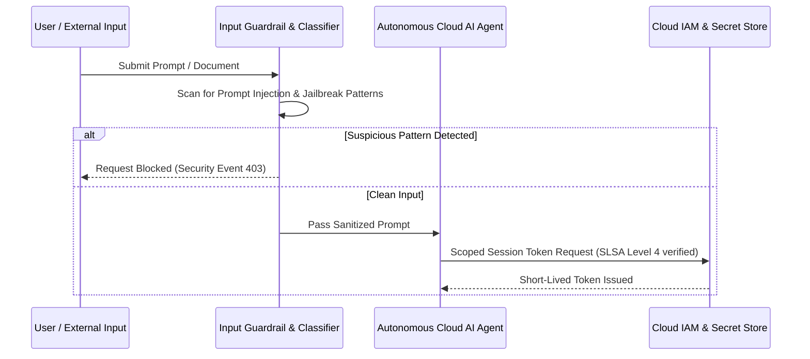

By late 2025, ENISA’s annual Threat Landscape report underscored a troubling evolution: cybercriminals and state-sponsored actors began deploying autonomous AI agents to discover zero-day vulnerabilities in cloud software supply chains and launch hyper-personalized deepfake social engineering attacks.

{: .box-warning}
**New Vector - Indirect Prompt Injection:** Attackers hide malicious instructions in public code repositories, web pages, or PDF documents parsed by enterprise RAG assistants, tricking cloud AI workers into exfiltrating database secrets.

### Defending the AI Pipeline: Guardrails & SLSA Attestation



### Python LLM Input Guardrail Decorator

```python
import re

PROMPT_INJECTION_PATTERNS = [
    r"ignore previous instructions",
    r"system prompt override",
    r"exfiltrate",
    r"reveal secret",
    r"eval\(",
    r"import os"
]

def sanitize_ai_input(func):
    """Decorator to inspect and block prompt injection attempts before LLM execution."""
    def wrapper(user_input: str, *args, **kwargs):
        for pattern in PROMPT_INJECTION_PATTERNS:
            if re.search(pattern, user_input, re.IGNORECASE):
                raise ValueError(f"Security Policy Violation: Malicious prompt pattern detected: '{pattern}'")
        return func(user_input, *args, **kwargs)
    return wrapper

@sanitize_ai_input
def process_customer_query(query: str):
    print(f"Executing query safely: {query}")
    # Call internal cloud model safely
    return "Query processed successfully."
```

### Media & Visual Concept

- **Cover Image:** Dark digital portrait of a synthetic holographic identity attempting to infiltrate a multi-factor authentication firewall grid.
- **Diagram:** Indirect Prompt Injection Guardrail Pipeline (Mermaid diagram above).
