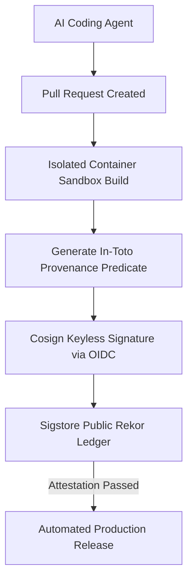

As autonomous AI agents began authoring a significant fraction of enterprise pull requests in early 2026, securing the Software Development Life Cycle (SDLC) required updating **Supply-chain Levels for Software Artifacts (SLSA)** standards for non-human contributors.

{: .box-important}
**Core Rule:** Code authored or modified by an AI agent must pass through cryptographic provenance attestation (Sigstore / Cosign), ephemeral sandboxed build workers, and mandatory automated security policy validation before merge.

### SLSA Level 4 Agentic Build Attestation Pipeline



### Cosign SLSA Verification Script

```bash
#!/bin/bash
# Verify cryptographic provenance of AI agent built container image
IMAGE_URI="registry.eu-sovereign.cloud/apps/payment-api:v3.1.0"

echo "Verifying SLSA Level 4 provenance attestation for ${IMAGE_URI}..."
cosign verify-attestation \
  --type slsaprovenance \
  --certificate-identity-regex "^https:/github.com/jpaquay/.*" \
  --certificate-oidc-issuer "https:/token.actions.githubusercontent.com" \
  ${IMAGE_URI}
```

### Media & Visual Concept

- **Cover Image:** Glowing cryptographic seal protecting an automated software supply chain assembly line operated by AI agents.
- **Explanatory Diagram:** SLSA Level 4 Agentic Supply Chain Verification Pipeline (Mermaid diagram above).
