Spring 2026 transformed Site Reliability Engineering (SRE). Instead of waking up human engineers for midnight PagerDuty incidents, cloud platforms now utilize **autonomous SRE agent swarms** that observe live eBPF kernel metrics, diagnose root causes, and execute self-healing remediation plans in real time.

{: .box-note}
**MTTR Breakthrough:** Automated anomaly diagnosis and traffic rerouting slashed Mean Time To Recovery (MTTR) across European multi-region clusters from 45 minutes to under 15 seconds.

### Autonomous SRE Remediation Architecture

```mermaid
flowchart LR
    eBPF[eBPF Telemetry & Metrics] --> Alert[Prometheus / Grafana Alerting]
    Alert --> Agent[SRE Diagnosis Agent]
    Agent -->|Query Logs & Traces| LLM[LLM Root Cause Analyzer]
    LLM -->|Generate Remediation Plan| Guardrail[Human-in-the-Loop Guardrail]
    Guardrail -->|Auto-Approved Low Risk| K8s[K8s Controller: Scale / Rollback]
    K8s --> PostMortem[Automated Incident Post-Mortem Generated]
```



### Python Autonomous SRE Remediation Trigger

```python
def autonomous_sre_incident_handler(alert_payload: dict):
    """Diagnose memory leak spike and execute automated rolling restart."""
    service_name = alert_payload.get("service")
    metric_type = alert_payload.get("metric")
    
    if metric_type == "MEMORY_LEAK_SPIKE":
        print(f"[SRE Agent] Memory leak detected in service '{service_name}'. Initiating Canary Rollback.")
        # Trigger deployment rollback to last known healthy commit digest
        return {"status": "SUCCESS", "action": "ROLLBACK_PREVIOUS_STABLE_DIGEST"}
    return {"status": "ESCALATE_TO_HUMAN"}
```

### Media & Visual Concept

- **Cover Image:** Advanced Site Reliability Engineering control room with holographic self-healing cloud nodes.
- **Explanatory Diagram:** Autonomous SRE Incident Remediation Flowchart (Mermaid diagram above).
