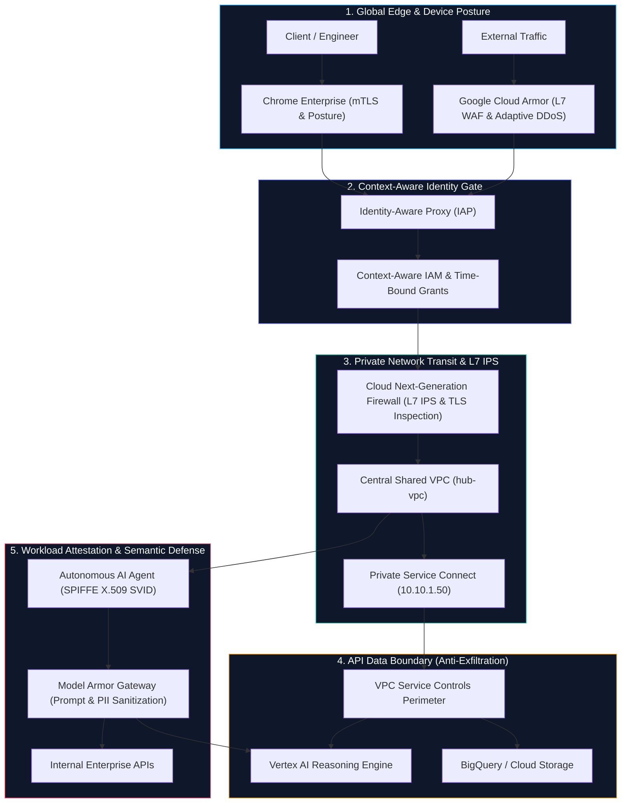
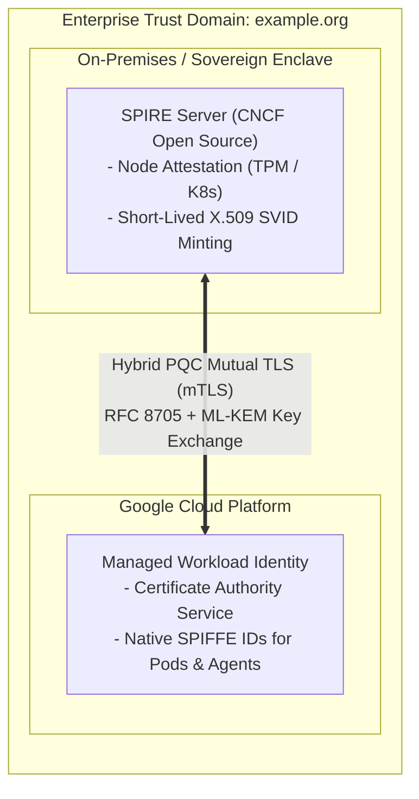

Look at the calendar: **June 6, 2026 (`06/06/26` — or for those who appreciate a good numerological omen, `202666`)**. If there is ever an "evil moment in the year" to audit what stands between your production data and the abyss, today is the day.

For thirty years, enterprise security was built like a medieval castle in the heart of Brussels. You dug a deep moat, raised thick stone walls (your Layer 3/4 firewall), stationed a guard at the Porte de Hal with a clipboard of allowed IP addresses, and went home for a Chimay Bleue feeling invincible. If a packet arrived from an approved IP on an approved TCP port, it was family.

In 2026, that castle isn't just obsolete—it is a tourist attraction with the drawbridge permanently welded down.

Why? Because modern enterprise traffic doesn't arrive on horseback across a drawbridge. It arrives over a six-lane highway called **`TCP Port 443`**, encrypted in TLS, driven by ephemeral serverless containers that change IP addresses faster than the weather in Uccle, and piloted by autonomous AI agents invoking tools at 3:00 AM. Worse yet, lurking just over the hill is the **Post-Quantum Cryptography (PQC) horizon**, where state-sponsored adversaries are already executing **Harvest Now, Decrypt Later (`HNDL`)** capture against static TLS tunnels and long-lived keys.

As our core engineering mantra goes: **Protect, Control, Comply/Audit**. Let's break down why static IP perimeters have collapsed, why this directly impacts every developer and user building in the cloud today, and how to architect a **multi-layered, identity-centric Zero Trust & PQC-ready defense** on Google Cloud.


---

## 1. Why This Matters to You: The 3 Lies of the IP Firewall

If you are a software engineer, SRE, or cloud architect, you might ask: *"Why should I care? Network security is the firewall team's problem."*

In 2026, that mindset will get your application—and your users—pwned before lunch. Here is why legacy IP firewalls fail your users every single day:

1. **The Brussels Waffle CIDR Problem (Ephemeral Infrastructure)**: When your workloads run on Cloud Run, GKE Autopilot, or serverless functions, IP addresses are recycled every few minutes. Maintaining static IP whitelists (`allow 34.x.x.x/32`) is a Sisyphean nightmare. What happens in reality? Exhausted engineers widen the firewall rule to a `/16` or `/8` subnet just to stop the pager from screaming. Congratulations: your firewall now has more holes than a warm Brussels waffle.
2. **The Trojan Praline Box on Port 443 (Semantic & Agentic Blindness)**: Virtually 100% of modern cloud traffic—and 100% of modern attacks—travels over encrypted HTTPS on Port 443. A traditional firewall sees an allowed IP connecting to `tcp:443` and waves it through. It has zero visibility into whether that TLS packet contains a legitimate GraphQL query or an **indirect prompt injection** smuggled inside a parsed PDF invoice telling your autonomous AI agent to dump your customer database.
3. **The `202666` Quantum Time-Bomb (Harvest Now, Decrypt Later)**: Even if your perimeter VPN or static TLS tunnel holds today, adversaries are actively recording encrypted transit traffic crossing public networks. As the **Post-Quantum Cryptography (PQC)** horizon approaches, packets encrypted with legacy RSA/ECC handshake primitives or authenticated with long-lived static JSON keys will be decrypted retroactively. If your architecture relies on public VIP routing and static keys instead of private transit (`Private Service Connect`), short-lived cryptographic identities (`SPIFFE`), and post-quantum hybrid key exchange (`ML-KEM`), your data is already living on borrowed time.

| Traditional IP Firewall Limitation | 2026 Threat Landscape Reality | Security Failure Mode |
| :--- | :--- | :--- |
| **Ephemeral Infrastructure** | Containers, Cloud Run instances, and serverless tasks change IP addresses every minute. | IP whitelists are either constantly stale or widened to broad CIDR ranges (`/16`, `/8`), destroying segmentation. |
| **Identity Blindness** | Multiple microservices or distinct users share a single egress NAT IP or pod network. | Compromising one low-privilege pod grants lateral network access to sensitive databases sharing that subnet. |
| **Port 443 Hegemony** | Virtually all enterprise traffic, including attacks, travels over encrypted TLS tunnels on port 443. | Firewalls cannot distinguish legitimate REST calls from prompt injections or credential exfiltration without semantic inspection. |
| **Agentic & Semantic Vectors** | Autonomous AI agents invoke tools, query databases, and consume untrusted web content dynamically. | Traditional firewalls observe standard HTTPS traffic; they cannot detect indirect prompt injection, data poisoning, or tool misuse. |
| **SaaS & PaaS Exfiltration** | Managed cloud services (BigQuery, Cloud Storage, Vertex AI) resolve to public VIPs. | An attacker with valid credentials can exfiltrate sensitive data directly into an external GCP bucket over legitimate Google APIs. |
| **Post-Quantum Harvest (`HNDL`)** | Adversaries intercept and store encrypted traffic traversing public networks today for future quantum decryption. | Static keys and public-transit TLS sessions without PQC hybrid key exchange (`ML-KEM`) expose multi-year secrets retroactively. |

---

## 2. The Zero Trust Paradigm: Multi-Layered Defense-in-Depth

Zero Trust replaces implicit perimeter nostalgia with an uncompromising engineering rule: **Never trust, always verify**. Every single request—whether from a human engineer in Ixelles or an autonomous Python agent in `europe-west1`—must be cryptographically authenticated, contextually authorized, and semantically inspected before a single byte touches your data.




### The Six Pillars of Modern Defense

1. **Network Abstraction & Private Transit (`PSC`)**: Eliminate public ingress and complex VPN mesh topologies. Keep traffic off the public internet using Central Shared VPCs and **Private Service Connect (`10.10.1.50`)**, starving Harvest-Now-Decrypt-Later collectors of public transit packets.
2. **API Data Boundary (`VPC Service Controls`)**: Enforce cryptographic perimeter fences around managed APIs (`bigquery.googleapis.com`, `aiplatform.googleapis.com`, `storage.googleapis.com`). Even if an attacker steals a valid OAuth token, VPC-SC blocks data exfiltration to unauthorized external buckets cold.
3. **Application Identity Gateways (`IAP`)**: Verify user identity, MFA state, and Chrome Enterprise device posture before a connection ever reaches your backend container.
4. **Adaptive Perimeter Defense (`Cloud Armor & Cloud NGFW`)**: Absorb global L3/L4/L7 DDoS floods at Google's edge while enforcing deep Layer 7 Intrusion Prevention (IPS) between internal VPC tiers.
5. **Semantic Layer Defense (`Model Armor`)**: Act as a cognitive firewall for Generative AI—inspecting LLM prompts, context windows, and tool outputs for indirect prompt injections, jailbreaks, and sensitive PII leakage.
6. **Cryptographic Workload & Agent Identity (`SPIFFE`)**: Exterminate long-lived JSON Service Account keys forever. Issue ephemeral, auto-rotating X.509 certificates (`SVIDs`) directly to pods and autonomous agents.

---

## 3. Production GCP Deployment Guide: The 6-Phase Blueprint

Talk is cheap; `gcloud` commands are idempotent. Here is the production blueprint to deploy this six-layer Zero Trust architecture across a Host Project (`net-hub-2026`) and Service Project (`sec-workloads-2026`).

```
+---------------------------------------------------------------------------------------------------------+
| Organization / Perimeter: "enterprise_zero_trust_perimeter" (VPC Service Controls)                      |
|                                                                                                         |
|  +-------------------------------------+       +-----------------------------------------------------+  |
|  | Host Project: "net-hub-2026"        |       | Service Project: "sec-workloads-2026"               |  |
|  |  +-------------------------------+  |       |  +-------------------------------+                  |  |
|  |  | Central Shared VPC: hub-vpc   |  |       |  | Service Subnet: workload-sub  |                  |  |
|  |  |  Subnet: hub-subnet           |  |       |  |                               |                  |  |
|  |  |  [PSC Endpoint: 10.10.1.50]   |==|=======|=>|  [Backend Agent Workload]    |                  |  |
|  |  +-------------------------------+  |       |  |   - Identity-Aware Proxy      |                  |  |
|  |                 │                   |       |  |   - Cloud NGFW Enterprise IPS |                  |  |
|  |                 ▼                   |       |  |   - SPIFFE Agent Identity     |                  |  |
|  |  +-------------------------------+  |       |  |   - Model Armor Interceptor   |                  |  |
|  |  | Google Cloud Armor            |  |       |  +-------------------------------+                  |  |
|  |  | (Edge WAF / DDoS Mitigation)  |  |                         │                                   |  |
|  |  +-------------------------------+  |                         ▼                                   |  |
|  +-------------------------------------+       |  [Protected APIs: Vertex AI, BigQuery, GCS]         |  |
|                                                +-----------------------------------------------------+  |
+---------------------------------------------------------------------------------------------------------+
```

---

### Phase 1: Central Shared VPC & Private Service Connect (PSC)

Centralize network governance in a dedicated Host Project (`net-hub-2026`) while delegating compute to Service Projects (`sec-workloads-2026`). Use **Private Service Connect** to route all Google API calls through a private internal IP (`10.10.1.50`) so sensitive analytical payloads never traverse public internet routing tables.

```bash
# 1. Configure the Central Shared VPC in the Host Project
gcloud compute networks create hub-vpc \
    --project=net-hub-2026 \
    --subnet-mode=custom

gcloud compute networks subnets create hub-subnet \
    --project=net-hub-2026 \
    --network=hub-vpc \
    --region=europe-west1 \
    --range=10.10.0.0/20 \
    --enable-private-ip-google-access

# 2. Enable Shared VPC Host
gcloud compute shared-vpc enable net-hub-2026

# 3. Associate Service Project
gcloud compute shared-vpc associated-projects add sec-workloads-2026 \
    --host-project=net-hub-2026

# 4. Create a Private Service Connect (PSC) Endpoint for Google APIs
gcloud compute addresses create psc-google-apis-ip \
    --project=net-hub-2026 \
    --region=europe-west1 \
    --subnet=hub-subnet \
    --addresses=10.10.1.50

gcloud compute forwarding-rules create psc-google-apis-fr \
    --project=net-hub-2026 \
    --region=europe-west1 \
    --network=hub-vpc \
    --address=psc-google-apis-ip \
    --target-google-apis-bundle=all-apis
```

---

### Phase 2: Anti-Exfiltration Perimeter with VPC Service Controls (VPC-SC)

VPC Service Controls wrap multi-tenant Google Cloud APIs in an identity- and network-aware boundary. Even if an attacker compromises a developer laptop or hijacks an agent's session, they cannot copy BigQuery tables or GCS objects to an external project.

```bash
# 1. Create an Access Level checking for authorized enterprise network ranges
cat <<EOF > access_policy.yaml
- ipSubnetworks:
  - 10.10.0.0/20
EOF

gcloud access-context-manager levels create CorpNetworkLevel \
    --policy=123456789012 \
    --basic-level-spec=access_policy.yaml \
    --title="Authorized VPC Internal Transit"

# 2. Deploy the Service Perimeter covering Storage, BigQuery, and Vertex AI
gcloud access-context-manager perimeters create EnterpriseZeroTrustPerimeter \
    --policy=123456789012 \
    --title="Enterprise Zero Trust Perimeter" \
    --resources=projects/987654321098,projects/112233445566 \
    --restricted-services=storage.googleapis.com,bigquery.googleapis.com,aiplatform.googleapis.com \
    --access-levels=CorpNetworkLevel
```

---

### Phase 3: Cloud Armor (Edge WAF) & Cloud NGFW Enterprise (L7 IPS)

Cloud Armor blocks volumetric DDoS and OWASP Top 10 exploits at Google's global edge, while Cloud NGFW Enterprise enforces deep Layer 7 Intrusion Prevention (IPS) directly on workload service accounts inside your VPC.

```bash
# 1. Create a Cloud Armor Security Policy with Adaptive DDoS & OWASP WAF
gcloud compute security-policies create edge-armor-policy \
    --project=net-hub-2026 \
    --description="Edge L7 WAF and Adaptive DDoS Protection"

# Enable Adaptive Protection (ML-based Layer 7 DDoS mitigation)
gcloud compute security-policies update edge-armor-policy \
    --project=net-hub-2026 \
    --enable-layer7-ddos-defense

# Attach pre-configured OWASP CRS rule against SQLi and remote code execution
gcloud compute security-policies rules create 1000 \
    --security-policy=edge-armor-policy \
    --project=net-hub-2026 \
    --expression="evaluatePreconfiguredExpr('sqli-v33-stable')" \
    --action=deny-403 \
    --description="Block SQL Injection"

# 2. Deploy Cloud NGFW Enterprise Policy with Intrusion Prevention (IPS)
gcloud compute firewall-policies create hub-firewall-policy \
    --project=net-hub-2026 \
    --description="Zero Trust L7 Intrusion Prevention Firewall"

gcloud compute firewall-policies rules create 500 \
    --firewall-policy=hub-firewall-policy \
    --action=apply_security_profile_group \
    --security-profile-group=projects/net-hub-2026/locations/global/securityProfileGroups/spg-enterprise-ips \
    --direction=INGRESS \
    --target-service-accounts=sa-backend-agent@sec-workloads-2026.iam.gserviceaccount.com \
    --layer4-configs=tcp:443
```

---

### Phase 4: Identity-Aware Proxy (IAP) & Context-Aware IAM

Never expose an admin dashboard or internal API directly to the internet. IAP intercepts every request, verifies Google Workspace / Workforce Identity credentials, validates device posture, and enforces time-bound IAM conditions.

```bash
# 1. Enable IAP on the internal/external backend service
gcloud compute backend-services update workload-backend-svc \
    --project=sec-workloads-2026 \
    --global \
    --iap=enabled,oauth2-client-id=CLIENT_ID.apps.googleusercontent.com,oauth2-client-secret=CLIENT_SECRET

# 2. Grant access exclusively through Context-Aware IAM bindings
gcloud compute backend-services add-iam-policy-binding workload-backend-svc \
    --project=sec-workloads-2026 \
    --global \
    --role="roles/iap.httpsResourceAccessor" \
    --member="group:secops-engineers@enterprise.com" \
    --condition='expression=request.time < timestamp("2026-12-31T23:59:59Z"),title=TimeBoundAccess'
```

---

### Phase 5: Semantic Firewalling with Model Armor

Network firewalls inspect packet headers; **Model Armor** inspects *intent*. When an autonomous agent or user interacts with an LLM, Model Armor screens prompts and completions for indirect prompt injections, jailbreaks, malicious URLs, and financial PII leaks—enforced by an organization-wide, non-bypassable **Floor Setting**.

```bash
# 1. Create a Model Armor template defining strict screening thresholds
cat <<EOF > model_armor_template.json
{
  "filters": {
    "promptSafety": {
      "detectionMode": "BLOCK",
      "confidenceThreshold": "MEDIUM_AND_ABOVE"
    },
    "sensitiveDataProtection": {
      "deidentificationTemplate": "projects/sec-workloads-2026/locations/europe-west1/deidentifyTemplates/mask-pii",
      "inspectTemplate": "projects/sec-workloads-2026/locations/europe-west1/inspectTemplates/detect-financial-pii"
    },
    "maliciousUrls": {
      "detectionMode": "BLOCK"
    }
  }
}
EOF

# 2. Register the template via the Model Armor API
curl -X POST \
    -H "Authorization: Bearer $(gcloud auth print-access-token)" \
    -H "Content-Type: application/json" \
    https://modelarmor.europe-west1.rep.googleapis.com/v1/projects/sec-workloads-2026/locations/europe-west1/templates?templateId=agent-guardrail-tmpl \
    -d @model_armor_template.json

# 3. Enforce an Organization-wide Floor Setting (Non-Bypassable Baseline)
# Floor settings ensure every AI deployment enforces foundational safety rules.
curl -X PATCH \
    -H "Authorization: Bearer $(gcloud auth print-access-token)" \
    -H "Content-Type: application/json" \
    "https://modelarmor.googleapis.com/v1/organizations/123456789012/locations/global/floorSetting" \
    -d '{
      "floorSetting": {
        "filters": {
          "promptSafety": {"detectionMode": "BLOCK", "confidenceThreshold": "HIGH"}
        }
      }
    }'
```

---

### Phase 6: Agent Identity & SPIFFE Workload Attestation

Autonomous AI agents cannot rely on static JSON Service Account keys (which inevitably end up leaked in a Git commit or harvested by an attacker). Google Cloud provisions dedicated **Agent Identities** using the CNCF **SPIFFE** standard, binding short-lived X.509 certificates directly to the agent's runtime and restricting its blast radius with a **Principal Access Boundary (`PAB`)**.

```bash
# 1. Create a Managed Workload Identity Pool for enterprise workloads
gcloud iam workload-identity-pools create enterprise-workload-pool \
    --project=sec-workloads-2026 \
    --location=global \
    --display-name="Enterprise SPIFFE Workload Pool"

# 2. Define an Agent Identity for an autonomous agent runtime
# The resulting SPIFFE ID takes the format:
# spiffe://agents.global.org-123456789012.system.id.goog/resources/aiplatform/projects/sec-workloads-2026/locations/europe-west1/reasoningEngines/fraud-analyst-agent

# 3. Grant least-privilege resource access directly to the Agent SPIFFE Principal
gcloud projects add-iam-policy-binding sec-workloads-2026 \
    --role="roles/bigquery.dataViewer" \
    --member="principal://agents.global.org-123456789012.system.id.goog/resources/aiplatform/projects/sec-workloads-2026/locations/europe-west1/reasoningEngines/fraud-analyst-agent"

# 4. Enforce a Principal Access Boundary (PAB) to restrict blast radius
cat <<EOF > agent_pab_policy.yaml
name: "organizations/123456789012/locations/global/principalAccessBoundaries/agent-boundary"
rules:
  - resources:
      - "projects/sec-workloads-2026"
    action: ALLOW
EOF
```

---

## 4. Open Source, Hybrid Clouds & The Post-Quantum (`PQC`) Horizon


Real-world European enterprises rarely live in a single cloud region. You have sovereign enclaves in Belgium, legacy bare-metal mainframes in Frankfurt, and AI reasoning engines on Google Cloud. Relying on proprietary firewall rules across hybrid boundaries creates vendor lock-in and fatal blind spots.

Even more urgently, **Post-Quantum Cryptography (`PQC`)** demands **crypto-agility**. When NIST standardized `ML-KEM` (FIPS 203) and `ML-DSA` (FIPS 204), the message was clear: any system hardcoded to static keys or un-upgradable TLS proxies will fail. By combining open-source **SPIFFE/SPIRE** with **Envoy Proxy** hybrid PQC mTLS (`X25519Kyber768` / `ML-KEM-768`), you achieve short-lived, quantum-resistant workload identity across every environment without touching application code.



### Why Open Source Identity is Non-Negotiable

| Open Source Technology | Governance Body | Role in Hybrid Zero Trust & PQC Architecture |
| :--- | :--- | :--- |
| **SPIFFE & SPIRE** | CNCF Graduated | Universal, platform-agnostic workload identity attestation. Bare-metal services in a private data center attest to an open-source SPIRE server and receive short-lived X.509 SVIDs identical to GCP Managed Workload Identities. |
| **Envoy Proxy** | CNCF Graduated | High-performance data plane for mTLS termination, hybrid Post-Quantum key exchange (`ML-KEM`), and fine-grained SPIFFE ID validation on every service-to-service hop without application code changes. |
| **Open Policy Agent (OPA)** | CNCF Graduated | Declarative Policy-as-Code. Decouples authorization logic from application binaries, enforcing uniform access decisions across Kubernetes clusters, API gateways, and CI/CD pipelines. |
| **Model Context Protocol (MCP)** | Open Standard Initiative | Standardizes how AI agents discover and invoke enterprise tools. Combined with SPIFFE mTLS and Model Armor filtering, MCP prevents arbitrary tool invocation and privilege escalation. |

---

## 5. The `06/06/26` Architectural Checklist: Protect, Control, Comply/Audit

Don't wait for a breach—or a quantum decryption headline—to retire your IP castle moat. Here is your tactical action plan starting today:

1. **Eliminate Public IP Dependencies (`Protect`)**: Migrate all internal microservices and managed databases behind Shared VPC subnets and Private Service Connect (`10.10.1.50`) endpoints. Strip external IP addresses from backend VMs and GKE nodes so traffic is invisible to public packet harvesters.
2. **Erect API Perimeter Fences (`Control`)**: Wrap all Google Cloud projects hosting BigQuery datasets, GCS buckets, and Vertex AI models inside **VPC Service Controls** perimeters.
3. **Exterminate Static Credentials (`Protect & Control`)**: Run a ruthless audit to delete all long-lived Service Account JSON keys. Replace them with **Managed Workload Identity** and **SPIFFE** federation with short-lived X.509 certificates.
4. **Enforce Context-Aware Access (`Control`)**: Place internal administrative dashboards and developer portals behind **Identity-Aware Proxy (`IAP`)** with hardware MFA and Chrome Enterprise device posture verification.
5. **Secure the Semantic Layer (`Comply/Audit`)**: Deploy **Model Armor** templates and organization-wide Floor Settings on every LLM and autonomous agent endpoint to block prompt injections and sensitive PII leaks before inference ever happens.
6. **Upgrade to PQC-Hybrid Transit (`Future-Proof`)**: Enable hybrid post-quantum key exchange (`ML-KEM`) on your Envoy ingress/egress meshes and Google Cloud load balancers to neutralize Harvest-Now-Decrypt-Later threats today.

Network firewalls remain fine for basic traffic shaping. But in an era defined by distributed microservices, autonomous AI agents, and the approaching Post-Quantum horizon, security belongs where decisions actually happen: **at the intersection of verified cryptographic identity, application context, and payload semantics.**

---

## Interactive Visual Gallery: Zero Trust & The PQC Horizon

Explore the illustrations and engineering diagrams from this post below:

<style>
.zt-carousel-container {
  position: relative;
  max-width: 880px;
  margin: 2.5rem auto;
  border-radius: 14px;
  overflow: hidden;
  box-shadow: 0 12px 32px rgba(0, 0, 0, 0.32);
  background: #0b111e;
  border: 1px solid rgba(56, 189, 248, 0.2);
}
.zt-carousel-slide {
  display: none;
  width: 100%;
  animation: ztFade 0.5s ease-in-out;
}
.zt-carousel-slide.active {
  display: block;
}
@keyframes ztFade {
  from { opacity: 0.35; }
  to { opacity: 1; }
}
.zt-carousel-slide img {
  width: 100%;
  height: 520px;
  object-fit: contain;
  background: #060911;
  display: block;
  margin: 0;
}
.zt-carousel-caption {
  padding: 1.1rem 1.5rem;
  background: linear-gradient(180deg, rgba(11, 17, 30, 0.95) 0%, rgba(15, 23, 42, 0.98) 100%);
  color: #f1f5f9;
  font-size: 0.95rem;
  line-height: 1.5;
  text-align: center;
  border-top: 1px solid rgba(255, 255, 255, 0.08);
}
.zt-carousel-btn {
  position: absolute;
  top: 44%;
  transform: translateY(-50%);
  background: rgba(15, 23, 42, 0.78);
  color: #ffffff;
  border: 1px solid rgba(255, 255, 255, 0.25);
  width: 44px;
  height: 44px;
  border-radius: 50%;
  cursor: pointer;
  font-size: 1.2rem;
  display: flex;
  align-items: center;
  justify-content: center;
  transition: all 0.2s ease;
  z-index: 10;
}
.zt-carousel-btn:hover {
  background: rgba(2, 132, 199, 0.9);
  color: #ffffff;
  transform: translateY(-50%) scale(1.08);
}
.zt-carousel-btn.prev { left: 16px; }
.zt-carousel-btn.next { right: 16px; }
.zt-carousel-dots {
  display: flex;
  justify-content: center;
  gap: 10px;
  padding: 0.75rem 1rem 1rem;
  background: #0f172a;
}
.zt-carousel-dot {
  width: 10px;
  height: 10px;
  border-radius: 50%;
  background: rgba(255, 255, 255, 0.28);
  cursor: pointer;
  transition: all 0.25s ease;
}
.zt-carousel-dot.active {
  background: #38bdf8;
  transform: scale(1.25);
}
@media (max-width: 640px) {
  .zt-carousel-slide img { height: 320px; }
}
</style>

<div class="zt-carousel-container" id="ztCarousel">
  <div class="zt-carousel-slide active">
    
    <div class="zt-carousel-caption">
      <strong>1 / 3 — The Fall of the Port 443 Castle Moat</strong>: Why legacy IP whitelists are blind to encrypted autonomous AI agents and quantum packet harvesting, while a crystalline Zero Trust & PQC lattice verifies every identity and semantic payload.
    </div>
  </div>
  <div class="zt-carousel-slide">
    
    <div class="zt-carousel-caption">
      <strong>2 / 3 — Engineering Architecture Blueprint</strong>: Defense-in-depth across 5 layers—Chrome Enterprise mTLS & Cloud Armor Edge WAF, IAP Context-Aware Gate, Shared VPC with Private Service Connect (10.10.1.50) & Cloud NGFW L7 IPS, VPC Service Controls Anti-Exfiltration Fence, and SPIFFE + Model Armor Semantic Gateway.
    </div>
  </div>
  <div class="zt-carousel-slide">
    
    <div class="zt-carousel-caption">
      <strong>3 / 3 — Surviving the Post-Quantum (PQC) Horizon</strong>: Why static JSON keys and IP whitelists shatter under Harvest-Now-Decrypt-Later (HNDL) quantum waves and prompt injections, while short-lived SPIFFE X.509 SVIDs with ML-KEM hybrid PQC mTLS and Model Armor remain resilient.
    </div>
  </div>

  <button class="zt-carousel-btn prev" onclick="moveZtSlide(-1)" aria-label="Previous slide">&#10094;</button>
  <button class="zt-carousel-btn next" onclick="moveZtSlide(1)" aria-label="Next slide">&#10095;</button>

  <div class="zt-carousel-dots">
    <span class="zt-carousel-dot active" onclick="setZtSlide(0)"></span>
    <span class="zt-carousel-dot" onclick="setZtSlide(1)"></span>
    <span class="zt-carousel-dot" onclick="setZtSlide(2)"></span>
  </div>
</div>

<script>
(function() {
  let currentZtIndex = 0;
  const container = document.getElementById('ztCarousel');
  if (!container) return;
  const slides = container.querySelectorAll('.zt-carousel-slide');
  const dots = container.querySelectorAll('.zt-carousel-dot');

  window.showZtSlide = function(index) {
    if (index >= slides.length) currentZtIndex = 0;
    else if (index < 0) currentZtIndex = slides.length - 1;
    else currentZtIndex = index;

    slides.forEach((s, i) => s.classList.toggle('active', i === currentZtIndex));
    dots.forEach((d, i) => d.classList.toggle('active', i === currentZtIndex));
  };

  window.moveZtSlide = function(step) {
    window.showZtSlide(currentZtIndex + step);
  };

  window.setZtSlide = function(index) {
    window.showZtSlide(index);
  };
})();
</script>
