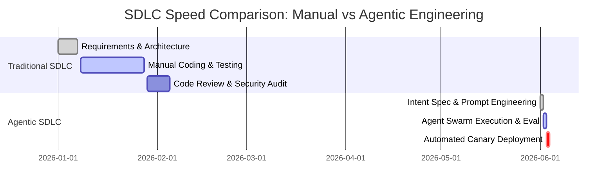

Mid-2026 marks a historic milestone in software engineering: the transition from human-centric manual coding to **Spec-Driven Agentic Swarm Orchestration**. Engineers no longer spend days writing boilerplate CRUD endpoints or manual integration tests; instead, they act as high-level system architects guiding specialized subagent teams.

{: .box-note}
**The New Engineering Stack:** Intent Specification -> Agent Swarm Plan & Verification -> Multi-Agent Execution -> Automated Continuous Evaluation (Eval Quality Flywheel).

### Traditional SDLC vs Agentic Swarm SDLC



### Multi-Agent Orchestration Blueprint

```python
from typing import List

class AgenticSwarmOrchestrator:
    def __init__(self, spec: str):
        self.spec = spec

    def execute_swarm(self) -> List[str]:
        """Orchestrate specialized subagents for research, coding, security scanning, and test generation."""
        subagent_results = []
        subagent_results.append(self._run_subagent("Researcher", "Analyze codebase architecture"))
        subagent_results.append(self._run_subagent("Coder", "Implement spec changes"))
        subagent_results.append(self._run_subagent("SecurityScanner", "Validate SLSA Level 4 & SAST rules"))
        subagent_results.append(self._run_subagent("Tester", "Synthesize unit and e2e integration tests"))
        return subagent_results

    def _run_subagent(self, role: str, task: str) -> str:
        return f"[{role}] Completed task: {task}"
```

### Media & Visual Concept

- **Cover Image:** A software architect directing a swarm of glowing intelligent AI agent nodes creating cloud microservices.
- **Explanatory Diagram:** SDLC Speed & Phase Comparison (Mermaid Gantt Chart above).
