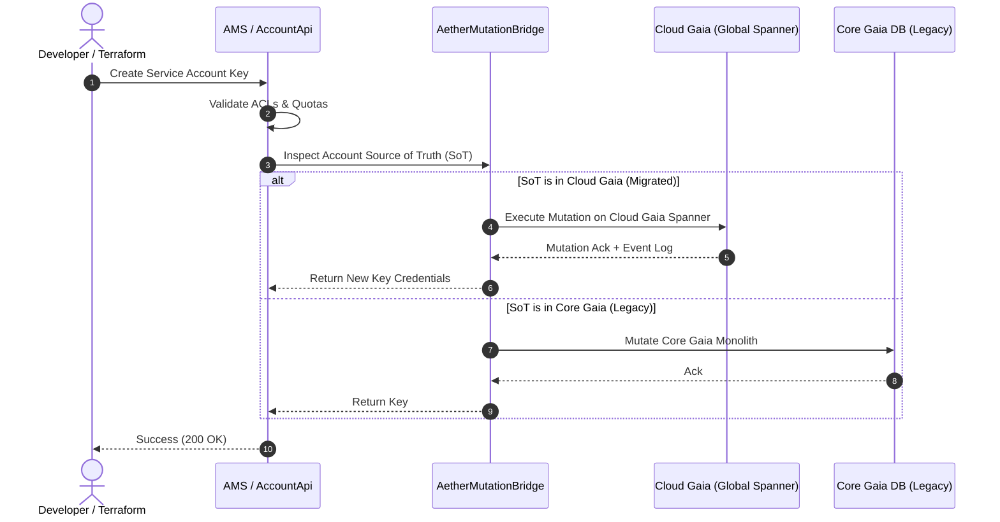

Behind every enterprise Google Cloud Platform (GCP) workload lies an unseen, hyper-critical foundational layer: **Identity**. Whether it is a serverless function fetching secrets, an automated machine learning job querying BigQuery, or a Kubernetes pod interacting with Cloud Storage, **Service Accounts** and machine identities form the nervous system of modern cloud computing.

For over a decade, however, these cloud-native identities shared an architectural umbilical cord with Google's consumer-facing account infrastructure. **Project Aether** was the ambitious engineering initiative that severed this legacy bond—decoupling cloud identity from global consumer infrastructure and establishing **Cloud Gaia** as a high-velocity, regionally isolated, 99.999% available identity powerhouse.

{: .box-note}
**Project Aether Mission:** Move the authoritative **Source of Truth (SoT)** for all GCP-native identity accounts—including IAM Service Accounts, Identity Namespace (IDNS) accounts, Console Service Robots (CSRs), and system robots—out of legacy Core Gaia and into **Cloud Gaia** native ownership, eliminating all global single points of failure.

### The Genesis: Why Identity Needed Decoupling

When GCP launched over a decade ago, building a brand-new identity authentication backend from scratch would have slowed cloud platform adoption. Instead, GCP leveraged **Core Gaia**—Google’s consumer identity service managing `@gmail.com` accounts, Workspace domains, and internal developer identities (`@prod.google.com`).

While Core Gaia offered massive scale, its architecture was optimized for human users:
- **Global Failure Domain**: Core Gaia’s central database topology meant that a severe global outage or latency spike in the core storage layer could propagate worldwide.
- **Lack of Regional Isolation**: Enterprise cloud customers operate under strict **Regional Fault Isolation** mandates. A network disruption in `us-central1` must *never* disrupt workloads running in `europe-west1`.
- **Data Residency (DRZ) Compliance**: Government and enterprise partners increasingly demand strict sovereignty boundaries where credential encryption metadata and account audit paths stay inside designated geographic borders.

### The Dual-Bridge Decoupling Architecture

To achieve identity decoupling without breaking hundreds of thousands of live enterprise apps, Project Aether introduced a **dual-bridge hybrid architecture**.

### Key Subsystems

| System Component | Role & Functionality | Architecture |
| :--- | :--- | :--- |
| **Core Gaia (Legacy)** | Continues to serve human users (`Gmail`, `Workspace`) and legacy robots. | Global Monolith & Core DB |
| **Aether Lookup Bridge** | Intercepts read requests in GaiaBE, checks pre-allocated ID space, and transparently routes lookups to Cloud Gaia with lag-tolerant strong reads. | Distributed RPC Proxy (`stubby`) |
| **Aether Mutation Bridge** | Intercepts account creation, key generation, and role mutations (`AMS Proxy`), dispatching mutations to authoritative Cloud Gaia storage. | Account Management Service (`AMS`) |
| **Aether Storage Migration Service** | Handles continuous batch data pipelines (`SQLP`/`Unipipe`), data parity reconciliation, and twice-daily sanity checks. | Batch Offline Pipeline / Placer |
| **Cloud Gaia (Modern)** | Global Control Plane + Multi-Region Data Planes with zero cross-regional runtime dependencies. | Multi-Region Cloud Spanner |

### Non-Disruptive Live Mutation Interception

### Breakthroughs & Real-World Impact

1. **Elimination of Global Blast Radius**: Service accounts running in `europe-west1` authenticate against localized Cloud Gaia Spanner instances.
2. **True Data Residency (DRZ)**: Metadata, service account keypairs, and credential histories stay inside customer-selected geographic boundaries.
3. **Foundation for Project Hemera**: Paved the way for decoupling human workforce authentication via Workforce Identity Federation.

---
*Published as part of the Aether Platform Cloud Architecture series.*
