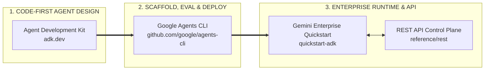

**Friday, September 18, 2026 · 22:04 CEST · Schaerbeek, Brussels.**

There is a very specific kind of Friday night clarity that only arrives at ten o'clock after you have pinned a race bib to your chest, laced up your running shoes with your son, and sprinted through the twilight paths of *Parc Josaphat* and the *Stade du Crossing*.

Tonight was **[Les 10,30 km de Schaerbeek 2026](https://les-10-30-schaerbeek.zatopekevent.com/)** ([official 1030.be agenda](https://www.1030.be/fr/agenda/1030-km-schaerbeek-2026))—the beloved neighborhood classic named after our 1030 postal code and its legendary green donkey mascot. **Arthur** lined up with bib **`#504`** to crush the 10 km loop and brought home the finisher medal around his neck; I pulled on my red Royal White Star HC jersey with bib **`#5639`** for the evening loop (`5.36 km` tracked across the park hills, `46m 18s` active time, and a very honest `85 Heart Points` in the bank).

And while the legs are cooling down and the post-run dopamine is still firing, I wanted to drop the news on what starts **this Monday, September 21st** right across town in Brussels' EU Quarter: **four full weeks of specialty coffee, live engineering, and agentic AI at the [Google AI Café Brussels — Connected Cup](https://rsvp.withgoogle.com/events/connected-cup/programme)**—including our team's hands-on **[ghacks.dev](https://ghacks.dev)** workshop next **Friday, September 25th**: **[Introduction to Agents with ADK](https://rsvp.withgoogle.com/events/introduction-to-agents-with-adk)**.

---

## Connected Cup: Four Weeks of Coffee, Policy & Code in Brussels (Sept 21 – Oct 16, 2026)

From **Monday, September 21 through Friday, October 16, 2026**, Google and creative design agency **BUMP** are opening **[Connected Cup](https://rsvp.withgoogle.com/events/connected-cup/programme)**—a pop-up specialty coffee bar and interactive event space right in the heart of Brussels' **EU Quarter** ahead of AI Innovation Month.

Think of it as the ultimate *Brusseleir* third place:
- **Four Weeks of Live Programming**: Keynotes, policy roundtables, live demos, startup showcases, and hands-on developer labs running every single week from **September 21 to October 16**.
- **Specialty Espresso Meets Real Builders**: Less slide-deck theater, more sitting down over a flat white with engineers, founders, researchers, and policymakers to look at what AI actually does in production.
- **Full Programme & Registration**: Browse all four weeks and grab your spot on the official portal $\rightarrow$ **[rsvp.withgoogle.com/events/connected-cup/programme](https://rsvp.withgoogle.com/events/connected-cup/programme)**.

---

## Next Friday (Sept 25): Join Our Team's `ghacks.dev` Workshop — *Introduction to Agents with ADK*

If you want to move past single-prompt chatbots and actually engineer **autonomous, multi-step AI agents** that reason, call tools deterministically, collaborate across sub-agents, and ship to production with enterprise guardrails, block your calendar for next **Friday, September 25th**.

Together with my team, we are hosting a high-energy, hands-on **[ghacks.dev](https://ghacks.dev)** session at the AI Café:

👉 **RSVP Here**: **[Introduction to Agents with Agent Development Kit (ADK)](https://rsvp.withgoogle.com/events/introduction-to-agents-with-adk)**

### The Open-Source & Enterprise Agent Stack We Are Hacking On

Everything we are building live on Friday is anchored in four open-source and Google Cloud developer pillars that you can start exploring tonight:

1. **[Agent Development Kit (`adk.dev`)](https://adk.dev/)**  
   The open-source, code-first framework for building modular AI agents. Define deterministic tool functions, compose sequential/parallel/loop multi-agent hierarchies, attach memory and state callbacks, and inspect every reasoning step locally with the built-in ADK Dev UI.
2. **[Google Agents CLI (`github.com/google/agents-cli`)](https://github.com/google/agents-cli)**  
   The developer's Swiss Army knife for the full agent lifecycle: scaffold production-ready agent templates in seconds (`agents-cli scaffold create`), run local evaluation suites (`agents-cli eval`), deploy seamlessly to Cloud Run or Vertex AI Agent Engine, and register agents directly into your enterprise catalog.
3. **[Gemini Enterprise Agent Platform — ADK Quickstart](https://docs.cloud.google.com/gemini-enterprise-agent-platform/agents/quickstart-adk)**  
   The fastest path to taking an ADK agent from your laptop into **Gemini Enterprise**—complete with identity propagation, grounded enterprise search, and zero-trust access governance.
4. **[Gemini Enterprise Agent Platform — REST API Reference](https://docs.cloud.google.com/gemini-enterprise-agent-platform/reference/rest)**  
   Full programmatic control over agent registration, discovery, session orchestration, and interoperability via clean REST endpoints.

---

## Friday Night Photo Drop: *Les 10,30 km de Schaerbeek* with Arthur

Before the four-week espresso-and-agents marathon kicks off on Monday morning, here are tonight's snapshots straight from the grass of *Parc Josaphat* after crossing the finish line of **[Les 10,30 km de Schaerbeek](https://les-10-30-schaerbeek.zatopekevent.com/)** with Arthur!

  

    

      

        
        

          Slide 1 / 3 · Post-Race Finish Line
          <strong>Father & Son at Les 10,30 km de Schaerbeek 2026</strong> — Arthur rocking bib <code>#504</code> with the official 1030 Schaerbeek donkey finisher medal, and yours truly in red Royal White Star colors (bib <code>#5639</code>).
        

      

      

        
        

          Slide 2 / 3 · Telemetry & Heart Points
          <strong>Evening Run Telemetry across 1030 Schaerbeek</strong> — Loops through Parc Josaphat & Stade du Crossing: <code>46m 18s</code> active time, <code>5.36 km</code>, and <code>85 Heart Points</code> locked in before 22:00.
        

      

      

        
        

          Slide 3 / 3 · Starting Monday Sept 21
          <strong>Next Stop: Google AI Café Brussels (Connected Cup)</strong> — Four weeks in the EU Quarter (Sept 21 – Oct 16) + our team's hands-on <code>ghacks.dev</code> ADK workshop next Friday, Sept 25!
        

      

    

    <button class="run-carousel-btn prev" id="schaerbeekRunPrev" aria-label="Previous slide">&#10094;</button>
    <button class="run-carousel-btn next" id="schaerbeekRunNext" aria-label="Next slide">&#10095;</button>
  

  

---

### All Essential Links & Resources

- **Google AI Café Brussels (Connected Cup — Sept 21 to Oct 16, 2026)**: [https://rsvp.withgoogle.com/events/connected-cup/programme](https://rsvp.withgoogle.com/events/connected-cup/programme)
- **Friday Sept 25th Workshop (`ghacks.dev` — Introduction to Agents with ADK)**: [https://rsvp.withgoogle.com/events/introduction-to-agents-with-adk](https://rsvp.withgoogle.com/events/introduction-to-agents-with-adk)
- **Agent Development Kit (ADK)**: [https://adk.dev/](https://adk.dev/)
- **Google Agents CLI (`google/agents-cli`)**: [https://github.com/google/agents-cli](https://github.com/google/agents-cli)
- **Gemini Enterprise Agent Platform — ADK Quickstart**: [https://docs.cloud.google.com/gemini-enterprise-agent-platform/agents/quickstart-adk](https://docs.cloud.google.com/gemini-enterprise-agent-platform/agents/quickstart-adk)
- **Gemini Enterprise Agent Platform — REST API Reference**: [https://docs.cloud.google.com/gemini-enterprise-agent-platform/reference/rest](https://docs.cloud.google.com/gemini-enterprise-agent-platform/reference/rest)
- **Les 10,30 km de Schaerbeek 2026**: [Official Zatopek Event Page](https://les-10-30-schaerbeek.zatopekevent.com/) · [1030.be Municipal Agenda](https://www.1030.be/fr/agenda/1030-km-schaerbeek-2026)
