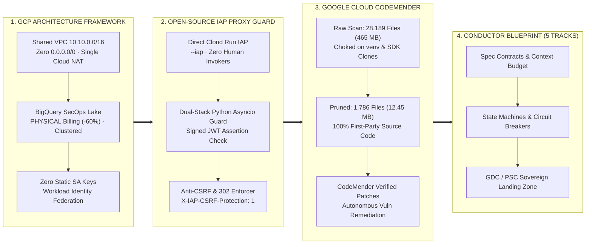

Cloud architecture rarely degrades through a single catastrophic misconfiguration. It drifts by a thousand tiny weekend conveniences: a temporary service account JSON key exported for a CI test, an unclustered audit log dataset quietly burning storage budget, a local development server bound to `0.0.0.0:8080`, or an automated vulnerability scanner drowning in half a gigabyte of third-party virtual environment files.

Periodic **Security Baselining** is the discipline of stopping feature velocity just long enough to pull every layer of your stack back to a verifiable, zero-trust invariant—and then locking those invariants into a repeatable delivery methodology so drift never creeps back in.

This weekend's engineering sprint tackled four concrete layers of public-cloud, open-source, and sovereign agentic hygiene:

1. **[Google Cloud Architecture Framework (Well-Architected Framework)](https://docs.cloud.google.com/architecture/framework) Alignment** across network segmentation, keyless identity, and BigQuery SecOps/FinOps telemetry.
2. **Zero-Trust Identity-Aware Proxy (IAP) Enforcement**—combining native Google Cloud Run IAP with a lightweight, open-source Python `asyncio` per-port reverse proxy guard for development hosts.
3. **Autonomous Vulnerability Remediation with [Google Cloud CodeMender](https://cloud.google.com/security/codemender)**—and the crucial discovery-scope lesson that pruned **28,189 indexed files (`465.45 MB`)** down to **1,786 first-party source files (`12.45 MB`)**.
4. **Sovereign Agentic Engineering with the Aether Builder Conductor Blueprint**—codifying the **5 Canonical Tracks** that turn one-off security fixes into self-diagnostic, GDC/PSC-ready, enterprise-grade open-source systems.

Here is the complete, open-source and public-cloud blueprint.

---

## Architectural Overview: From Cloud Landing Zones to Sovereign Agentic Systems

If [Beyond the Perimeter: Why IP Firewalls Fail Against 2026 Threats](/blog/2026-06-06-beyond-the-perimeter-zero-trust-pqc-horizon/) established why static IP allowlists are obsolete, this baseline translates that principle into concrete Google Cloud Platform (GCP) controls, open-source reverse proxies, autonomous code remediation, and spec-driven engineering tracks.

---

## Pillar 1: Aligning with the Google Cloud Architecture Framework

The **[Google Cloud Architecture Framework](https://docs.cloud.google.com/architecture/framework)** provides a rigorous blueprint across Security, Reliability, Cost Optimization, Operational Excellence, and Performance. For a multi-project GCP Organization, aligning to the framework comes down to three enforceable invariants: **Protect, Control, and Audit**.

### 1. Network Segmentation & Keyless Identity (*Protect & Control*)
- **Folder Hierarchy Isolation**: Strict separation between shared foundation infrastructure (`common` folder hosting the Shared VPC host project and central SecOps/FinOps hubs) and isolated application environments (`workloads` folder).
- **Zero-Trust Shared VPC Topology**: A single RFC 1918 supernet (`10.10.0.0/16`) partitioned into regional serverless and compute subnets with **Private Google Access (PGA)** enabled across all subnets, **zero `0.0.0.0/0` VPC ingress rules**, **zero public VM external IPs**, and a single deterministic outbound **Cloud NAT IP** for auditable egress.
- **Eliminating Static Service Account Keys**: Replaced remaining user-managed JSON service account keys in CI/CD runners with **Workload Identity Federation (WIF)**. Short-lived OIDC token exchange eliminates long-lived static secrets entirely.

### 2. BigQuery SecOps Audit Lake Optimization (*Comply & Audit Without the Storage Tax*)
Aggregating organization-wide Cloud Audit Logs (`admin_activity`, `data_access`, and `system_event`) into a central BigQuery dataset is foundational for security forensics—but unoptimized log sinks quickly inflate cloud spend. Two configuration changes delivered immediate structural savings:
- **Switching Datasets from `LOGICAL` to `PHYSICAL` Storage Billing**: Cloud Audit Log JSON payloads compress exceptionally well (typically 4:1 to 6:1). Altering the dataset storage billing model (`ALTER SCHEMA ... SET OPTIONS(storage_billing_model = 'PHYSICAL')`) immediately reduced BigQuery storage costs by **50–70%**.
- **Partitioning & Multi-Column Clustering**: Consolidated legacy date-sharded tables into ingestion-time partitioned tables clustered by `serviceName, methodName, principalEmail`. Incident response queries that previously scanned hundreds of gigabytes now prune **>90% of scanned bytes** and complete in under two seconds.

### 3. FinOps Guardrails & Automated Baseline Verification
Configured a 5-tier Cloud Billing budget alert pipeline (`50%`, `80%`, `90%`, `100%`, `120%` thresholds) streaming to Pub/Sub alongside Active Assist / Cloud Recommender views, surfacing over **$20k/year in right-sizing opportunities** across unattached persistent disks, idle IPs, and Cloud Run concurrency settings. Every control is continuously verified by a 56-check shell validation suite and a 24-point Architecture Framework scorecard.

---

## Pillar 2: Zero-Trust Identity-Aware Proxy (IAP) — Cloud & Local Ports

**Identity-Aware Proxy (IAP)** shifts access control from the network layer to the application layer: every HTTP request must carry a cryptographically verifiable identity assertion before it reaches application code.

This weekend's baseline closed unverified ingress across both **managed Cloud Run services** and **local development ports**.

### 1. Direct Cloud Run IAP Hardening
Google Cloud Run's native IAP integration (`--iap`) allows serverless containers to enforce identity verification at the edge without deploying a separate load balancer stack:
1. **Mandatory Edge Authentication**: Every service deploys with `--iap` and `--no-allow-unauthenticated`.
2. **Dedicated Service Agent Isolation**: Only the Google-managed IAP service agent (`service-<PROJECT_NUMBER>@gcp-sa-iap.iam.gserviceaccount.com`) is granted `roles/run.invoker` on the Cloud Run service.
3. **Zero Direct Human Invokers**: Engineers and groups never hold `roles/run.invoker` directly on the underlying compute service; access is granted exclusively at the IAP policy layer via `roles/iap.httpsResourceAccessor`.
4. **Custom OAuth 2.0 Clients for Cross-Domain Federation**: Binding an explicit OAuth 2.0 client configuration avoids `Error 403: org_internal` blocks when authorizing external collaborators across Google Workspace domains.

### 2. Open-Source Python `asyncio` Per-Port Proxy Guard
While production cloud workloads sit behind IAP, developers routinely run local web servers, API previews, and observability dashboards on ports `3000`, `4321`, `8080`, or `8888`. Binding those ports to `0.0.0.0` without an authentication layer exposes local services to any host on the local network segment.

To enforce the same Zero-Trust model locally, we use a lightweight, open-source Python `asyncio` reverse proxy guard that sits in front of development ports:

- **Dual-Stack Socket Binding**: Listens across both IPv6 (`[::]`) and IPv4 (`0.0.0.0`) sockets with zero third-party runtime bloat.
- **Cryptographic Identity Verification**: Never trusts spoofable plaintext headers such as raw `X-Goog-Authenticated-User-Email` on unauthenticated sockets, and **never falls back to the local OS user identity** on network requests. Every request must present a valid, signed JWT assertion (`X-Goog-IAP-JWT-Assertion`) verified against public signing keys.
- **Anti-CSRF Enforcement**: State-mutating proxy endpoints require `HTTP POST` accompanied by an explicit custom header (`X-IAP-CSRF-Protection: 1`) and strict Same-Origin `Sec-Fetch-Site` validation.
- **Automatic `302 Found` HTTPS Upgrade**: Unauthenticated plain-HTTP probes (`http://<host>:<port>`) receive an immediate `302 Found` redirect to the authenticated HTTPS reverse proxy endpoint.
- **Native Authenticated Daemon Allowlist**: Services that already enforce their own end-to-end TLS and token authentication are exempted via a declarative allowlist so WebSockets, gRPC streams, and HTTP/2 multiplexing operate without double-proxying.

---

## Pillar 3: Google Cloud CodeMender & The 28,189-File Discovery Lesson

With the cloud organization and network ingress locked down, the third pillar focused on autonomous code security using **[Google Cloud CodeMender](https://cloud.google.com/security/codemender)**—an AI-powered security agent designed to proactively identify complex vulnerabilities and generate verified, root-cause remediation patches.

Running CodeMender across a multi-service Python and cloud-native repository surfaced a critical operational lesson that applies to every AI security tool on the market.

### The Trap: Scanning 465 MB of Third-Party Virtual Environments
When we ran the initial discovery pass across the workspace with default settings, the scanner indexed **28,189 files totaling `465.45 MB`**.

The culprit? Most default discovery configurations exclude `node_modules` by default—and *nothing else*. In a modern Python and cloud engineering repository, that means your AI security agent spends 97% of its analysis budget inspecting:
- Local Python virtual environments (`venv/`, `.venv/`),
- Vendored open-source SDK repositories cloned into subdirectories for local reference,
- Symlinked third-party test fixtures.

Asking an AI security agent to reason over 26,400 files of third-party `site-packages` dilutes context windows, inflates scan latency, and buries real first-party vulnerabilities under noise.

### The Solution: Scope Pruning for 100% First-Party Signal
By explicitly configuring discovery exclusion patterns (`exclude_patterns`) to ignore virtual environments (`**/venv/**`, `**/.venv/**`), vendored open-source SDK directories, and external symlinks prior to analysis:

| Metric | Before Baseline (Default Discovery) | After Baseline (Tuned Exclusions) | Improvement |
| :--- | :---: | :---: | :---: |
| **Indexed Files** | `28,189 files` | **`1,786 files`** | **-93.7% noise** |
| **Indexed Payload** | `465.45 MB` | **`12.45 MB`** | **-97.3% payload** |
| **First-Party Code Ratio** | 6.3% first-party code | **100% first-party code** | **15.8x focus gain** |

With the scope pruned to the **1,786 first-party source files (`12.45 MB`)** that we actually author and deploy, **[CodeMender](https://cloud.google.com/security/codemender)** delivered immediate, high-signal results:
1. **Cross-Module Data-Flow Analysis**: Traced untrusted request parameters across module boundaries to identify subtle injection and unsafe deserialization paths that traditional regex static analyzers miss.
2. **Verified Root-Cause Remediation Diffs**: Generated clean, minimal git diffs that fixed the underlying vulnerability without breaking existing API contracts or unit test suites.
3. **Rapid Human Review Loop**: Every proposed patch was reviewed, validated against the automated test suite, and committed in a single afternoon session.

---

## Pillar 4: The Aether Builder Conductor Blueprint — 5 Canonical Tracks for Sovereign Agentic Systems

Fixing a cloud organization or a repository once is a weekend chore; preventing architectural entropy across dozens of community and enterprise agentic repositories requires a deterministic engineering methodology.

That is where the **Aether Builder Conductor Blueprint** comes in: a spec-driven open-source methodology designed to **scaffold, evaluate, harden, and document enterprise-grade, sovereign agentic systems**. Instead of letting AI agents write ad-hoc glue code that drifts out of compliance, every repository is orchestrated through **5 Canonical Conductor Tracks** stored directly in version control (`conductor/tracks/<track_id>/`).

### The 5 Canonical Tracks

#### Track 1: Machine-Readable Spec Contracts & Context Budgeting
- **The Plan is the Source of Truth**: Every architectural module, security control, or feature iteration begins with machine-readable contracts (`spec.md`, `plan.md`, `metadata.json`, and `index.md`) committed before a single line of implementation code is written.
- **Strict Context & AST Budgeting**: Just as pruning `465.45 MB` of `venv` noise down to `12.45 MB` unlocked CodeMender's precision, Track 1 enforces explicit token budgets, strict module boundaries, and declarative exclusion contracts so coding and security agents never hallucinate across unbounded context windows.

#### Track 2: Resilient Agent State Machines with Circuit Breakers
- **Deterministic Execution Loops**: Agentic workflows are modeled as explicit, finite state machines rather than open-ended prompt loops—complete with retry budgets, exponential backoff **circuit breakers**, and echo-loop prevention (`MachineID` fencing).
- **100% Hermetic Test Coverage & Mock Factories**: Unit and CLI test suites are strictly forbidden from depending on ambient developer credentials (such as local Application Default Credentials) or live network endpoints. Every external cloud client is injected through exported factory interfaces (`SetClientFactory(...)`) backed by deterministic in-memory repositories or local emulators, enforcing a strict **Red $\rightarrow$ Green $\rightarrow$ Refactor** loop with **100% hermetic test coverage**.

#### Track 3: Dual Deterministic & Golden LLM Evals
- **Two-Tier Verification Gate**: Traditional unit tests cannot catch prompt regressions, while LLM-only evaluations are too slow and non-deterministic to catch race conditions. Track 3 requires both:
  1. **Deterministic Invariant Gate**: Fast, 100% hermetic test suites verifying POSIX exit codes, strict `--json` output schemas, race-condition freedom (`-race`), and security header assertions.
  2. **Golden LLM Evaluation Gate**: Curated golden trajectory datasets scored by automated LLM-as-a-Judge rubrics to verify tool-calling accuracy, grounding fidelity, and policy compliance before any release tag is cut.

#### Track 4: Sovereign Self-Diagnostic Cloud Landing Zones (`GDC` / `PSC`-Ready)
- **Self-Verifying `<cli> setup` Engines**: Every shipped tool includes an interactive, self-diagnostic setup command that audits IAM bindings, service APIs, and network routes with visual terminal checklists (`[✓]`, `[✗]`, `[!]`), `--dry-run` idempotency, and copy-pasteable remediation hints.
- **Sovereign-by-Default Topology**: Engineered from day one for European digital sovereignty requirements—defaulting to **European regions**, routing all service-to-service traffic over **Private Service Connect (PSC)** endpoints with zero public internet traversal, and maintaining strict architectural compatibility with **Google Distributed Cloud (GDC)** air-gapped and sovereign deployments.

#### Track 5: 3-Tier Field Enablement & Codelabs
An enterprise architecture that cannot be understood in 60 seconds or reproduced in 30 minutes does not get adopted. Track 5 enforces zero-friction open-source distribution (multi-arch static binaries, Homebrew taps, SHA256-verified installers, and clean changelogs) paired with a **3-Tier Documentation Standard**:
- **Tier 1 (`README.md`)**: 60-second executive pitch, architecture badges, Mermaid data-flow diagram, 3-Step Quickstart (`Install` $\rightarrow$ `Setup & Verify Cloud` $\rightarrow$ `Start`), and a complete CLI Command Matrix.
- **Tier 2 (`docs/` Deep-Dive Hub)**: Dedicated architectural and operational runbooks (`architecture-and-sync.md`, `setup-and-cloud.md`, `operations-and-audit.md`).
- **Tier 3 (Field Enablement & Codelabs)**: Automated GitHub Pages documentation portals paired with step-by-step, self-paced workshop **Codelabs (`docs/codelab.md`)** so field engineers and customers can validate the entire sovereign stack hands-on.

---

### References & Official Documentation

- **Google Cloud Architecture Framework**: [https://docs.cloud.google.com/architecture/framework](https://docs.cloud.google.com/architecture/framework)
- **Google Cloud CodeMender**: [https://cloud.google.com/security/codemender](https://cloud.google.com/security/codemender)
- **Beyond the Perimeter (Zero Trust & PQC Series)**: [Why IP Firewalls Fail Against 2026 Threats and How Zero Trust Rewrites Enterprise Defense](/blog/2026-06-06-beyond-the-perimeter-zero-trust-pqc-horizon/)
