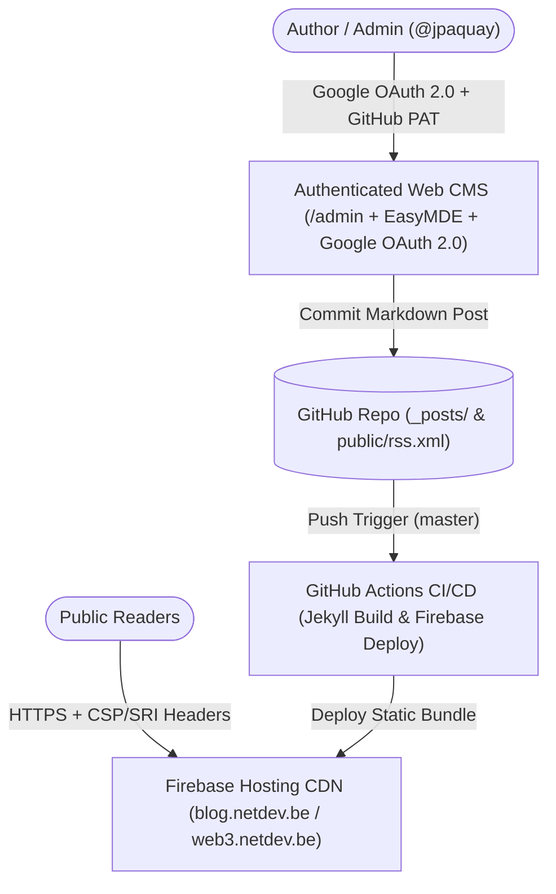

# Engineering, Security & Architecture Review — `jpaquay.github.io` (`blog.netdev.be`)

- **Repository**: [`jpaquay/jpaquay.github.io`](https://github.com/jpaquay/jpaquay.github.io)
- **Live Site**: [`https://blog.netdev.be`](https://blog.netdev.be) / [`https://web3.netdev.be`](https://web3.netdev.be)
- **Author & Maintainer**: **Jerome CG Paquay (`@jpaquay`)**
- **License**: **Creative Commons Attribution-ShareAlike 4.0 International (`CC BY-SA 4.0`)**
- **Review Date**: September 2026

---

## 1. Executive Summary

`jpaquay.github.io` powers the personal engineering blog, essays, and browser-based GitHub CMS (`blog.netdev.be`) of **Jerome CG Paquay (`@jpaquay`)**. It combines a **Jekyll 5.x** static site generator with an authenticated **EasyMDE + Google Identity Services (OAuth 2.0)** web editor (`/admin/`) that commits Markdown posts directly via the GitHub REST API, triggering automated CI/CD builds to **Firebase Hosting (`netdev-firebase`)**.

---

## 2. System Architecture

---

## 3. Security & Repository Hygiene Audit

| Audit Dimension | Status | Remediation & Verification |
| :--- | :---: | :--- |
| **Environment Secret Protection** | ✅ FIXED | Hardened `.gitignore` to exclude `.env`, `.env.*`, `.agents/gcloud.env`, `*.pem`, `*.key`, and `*service-account*.json`. |
| **Content Security Policy & SRI** | ✅ PASS | Enforces strict CSP headers, Subresource Integrity (SRI) hashes on third-party scripts, and Jest security test suites (`__tests__/`). |
| **RSS / Sitemap Synchronization** | ✅ PASS | Synchronized latest September 2026 posts and WebP hero assets across `public/rss.xml`, `public/blog/rss.xml`, `public/feed.xml`, and `public/sitemap.xml`. |
| **Licensing & Attribution** | ✅ PASS | Standardized under **CC BY-SA 4.0** attributed to **Jerome CG Paquay (`@jpaquay`)** while preserving upstream MIT theme notices. |
