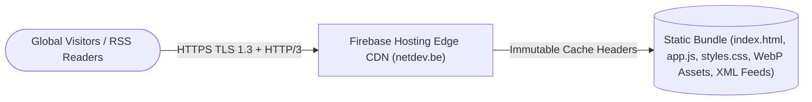

# `/net/dev` Portal & Firebase Hosting Hub (`netdev.be`) ⚡

[](https://creativecommons.org/licenses/by-sa/4.0/)
[-blue)](https://github.com/jpaquay)
[](https://firebase.google.com/products/hosting)
[](https://netdev.be)

Official static web portal, interactive engineering portfolio, and syndicated RSS/Sitemap edge distribution hub for **`netdev.be`**, built for **Google Firebase Hosting CDN** by **Jerome CG Paquay (`@jpaquay`)**.

---

## 🏗️ Edge Architecture



For a full engineering, security, and caching audit, see [docs/ARCHITECTURE_REVIEW.md](./docs/ARCHITECTURE_REVIEW.md).

---

## 📂 Repository Structure

```text
├── index.html          # Main interactive portal & engineering showcase
├── netdev.html         # Alternate portal view
├── app.js              # Interactive UI & portfolio logic
├── styles.css          # Responsive typography & dark/light styling
├── assets/             # Optimized WebP post hero imagery & static media
├── blog/               # Syndicated blog RSS feed (blog/rss.xml)
├── v2/ & web3/         # Portal versioned & Web3 static views
├── rss.xml / feed.xml  # Syndicated RSS 2.0 & Atom feeds
├── sitemap.xml         # Search engine XML sitemap
├── firebase.json       # Firebase Hosting CDN caching & cleanUrls config
└── docs/               # Architecture & security review
```

---

## 🚀 Quickstart & Firebase Hosting Deployment

### 1. Local Preview
```bash
# Serve locally via Firebase Hosting emulator
firebase serve --only hosting
```

### 2. Deploy to Firebase Hosting (`netdev.be`)
```bash
firebase deploy --only hosting
```

---

## 🤝 Contributing

Contributions and improvements are welcome! See [CONTRIBUTING.md](./CONTRIBUTING.md) for guidelines.

---

## 👏 Credits & Author

Designed, authored, and maintained by **Jerome CG Paquay (`@jpaquay`)** — [https://github.com/jpaquay](https://github.com/jpaquay).

---

## 📜 License

Licensed under the **Creative Commons Attribution-ShareAlike 4.0 International License (`CC BY-SA 4.0`)** — Copyright © 2026 **Jerome CG Paquay (`@jpaquay`)**. See [LICENSE](./LICENSE) for full legal terms.
