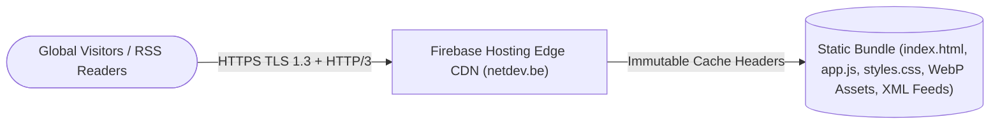

# Engineering, Security & Architecture Review — `netdev.be`

- **Repository**: [`jpaquay/netdev.be`](https://github.com/jpaquay/netdev.be)
- **Live Portal**: [`https://netdev.be`](https://netdev.be)
- **Author & Maintainer**: **Jerome CG Paquay (`@jpaquay`)**
- **License**: **Creative Commons Attribution-ShareAlike 4.0 International (`CC BY-SA 4.0`)**
- **Review Date**: September 2026

---

## 1. Executive Summary

`netdev.be` is a lightweight, zero-server static web portal, interactive portfolio, and syndicated RSS/Sitemap edge bundle served via **Google Firebase Hosting CDN**. It delivers sub-20ms global edge latency with immutable WebP image caching (`max-age=31536000, immutable`), clean URL routing (`cleanUrls: true`), and zero runtime attack surface.

---

## 2. System Architecture

---

## 3. Security & Performance Audit

| Audit Dimension | Status | Findings & Verification |
| :--- | :---: | :--- |
| **Zero Server Attack Surface** | ✅ PASS | Pure static HTML5/CSS3/ES6 + WebP bundle with zero server-side code execution or database exposure. |
| **Firebase Hosting Cache Headers** | ✅ PASS | Configured `firebase.json` with 1-year immutable caching for static media (`*.webp`, `*.svg`, `*.woff2`) and 1-hour revalidation for JS/CSS/XML feeds. |
| **Secret & Cache Protection** | ✅ PASS | `.gitignore` excludes `.firebase/`, `*.log`, `.env*`, and credential files. |
| **Open Licensing & Governance** | ✅ PASS | Licensed under **CC BY-SA 4.0** attributed to **Jerome CG Paquay (`@jpaquay`)**. |
